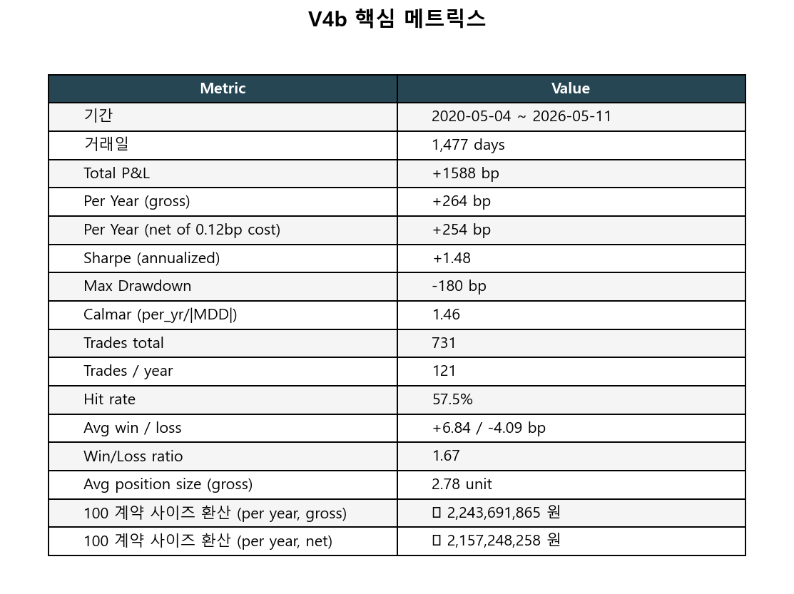
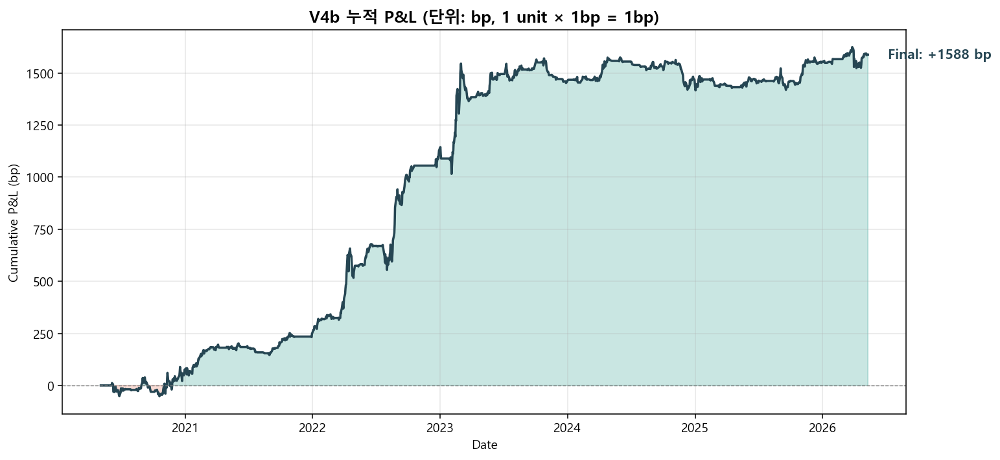
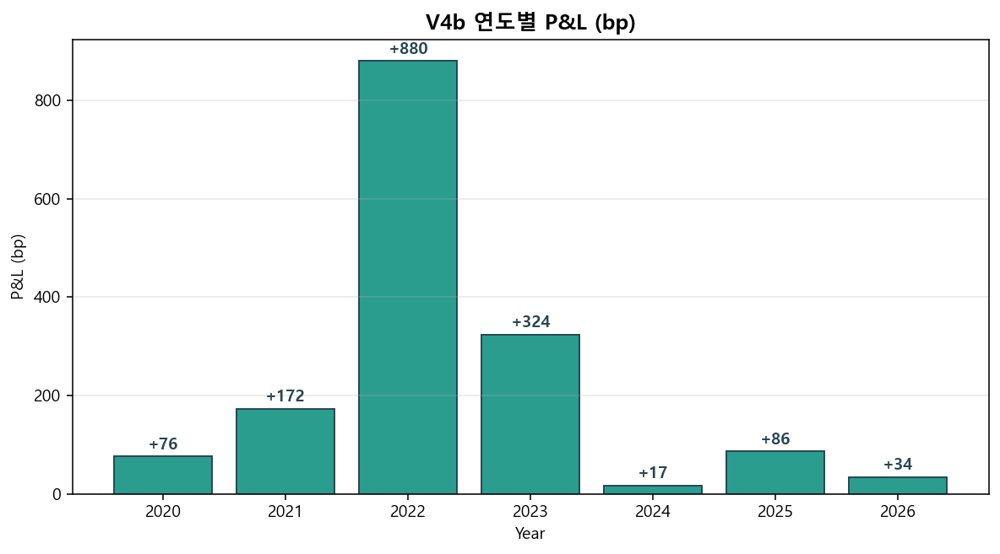
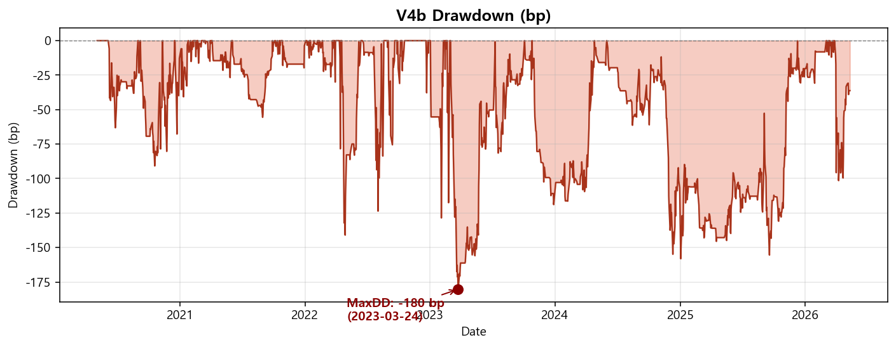
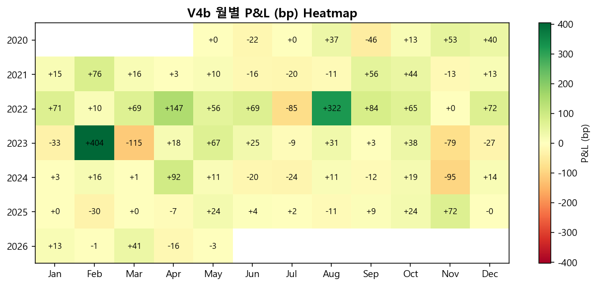
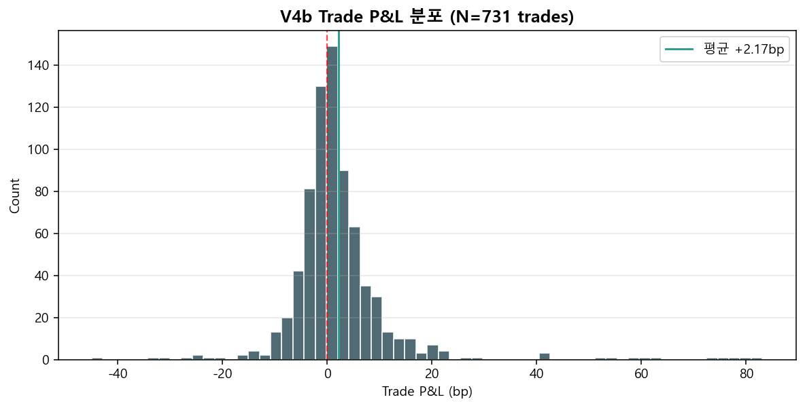
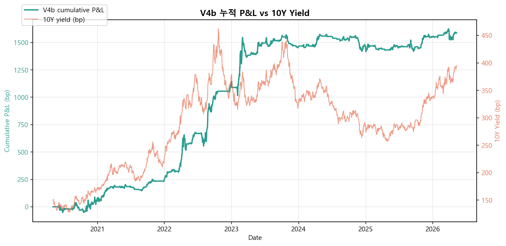
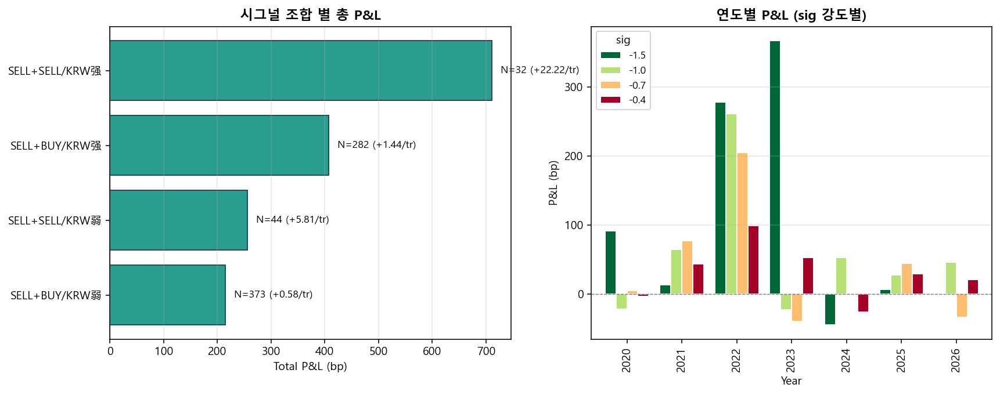

# Fund Flow × Futures × FX → V4b Strategy — Research Findings

> 작성일: 2026-05-12 (V4b 최종 모델 채택)
> 데이터: 2020-05-04 ~ 2026-05-11 (1,477 거래일)
> 분석 스크립트: `01_data_exploration.py` ~ `15_report_charts.py`

## 0. 데이터 소스

| 테이블/파일 | 내용 | 기간 |
|---|---|---|
| `ktb_trade_flow_features` | 종목별 4 주체 × 4 윈도우 net buy | 2014- |
| `ktbf_netbuy` | KTB3F / KTB10F / KTB30F 주체별 net buy (계약수) | 2015- |
| `USDKRW_INFOMAX.xlsx` | USDKRW 중간환 (15:30) | 2010- |
| `ktb` (label='3년지표', '10년지표') | 시장 yield bp | 2010- |

---

## 1. 리서치 흐름 요약

### Stage 01 — 데이터 정합성
- 4 주체 × 4 윈도우 모두 정상. 단위: 추정 억원 net buy.
- 최근 1년 active bond: 약 30종목 (잔존 2-10Y on-the-run).

### Stage 02 — 종목 IC (개별 종목 단위)
- **foreigner sum_3d → fwd_dy_21d_bp IC = +0.051** (**역방향**) — 외국인이 종목 매수하면 21d 후 yield 상승.
- 단순 "fundamental flow → price up" 가설 기각.

### Stage 03 — Aggregate vs Idiosyncratic 분해
| Signal | Target | IC |
|---|---|---|
| **외국인 aggregate sum_3d** | **ΔY_3Y_21d** | **+0.203** ★ |
| 외국인 aggregate sum_3d | ΔY_10Y_21d | +0.137 |
| 외국인 sum_3d (종목) | Δε (idiosyncratic) | -0.046 |

→ 시장 aggregate level 의 강한 **contrarian** 패턴이 진짜 신호.

### Stage 04 — 선물 (KTB3F, KTB10F)
| Signal | 5d | 10d | 21d |
|---|---|---|---|
| KTB3F 외국인 5d cum → ΔY_3Y | -0.104 | **-0.152** | -0.081 |
| KTB10F 외국인 5d cum → Δslope | +0.117 | +0.154 | **+0.142** |

- 선물 자체는 단기 정방향이지만 21d 에는 **slope steepening** (10Y 약세) 전환.
- **선물 vs 현물 외국인 IC = -0.108** → 두 flow 는 반대 방향 (헤지/basis).

### Stage 05 — Look-ahead Audit (★ 결정적)
| Signal | raw IC | **past Δy 제거 후** |
|---|---|---|
| KTB10F 5d → ΔY_10Y_21d | -0.032 | **-0.012 (소멸)** |
| **현물 외국인 5d → ΔY_3Y_21d** | +0.111 | **+0.110 (99% 잔존)** |

- 선물 flow ↔ past 5d Δy IC = **-0.472** (KTB10F) — 절반 가까이 trend follow.
- **선물 단독은 momentum 그림자**, **현물 contrarian 은 진짜 시그널**.

### Stage 06 — FX Overlay (★★ 핵심 메커니즘)
4 조합 × FX 환경:

| 조합 | N | past 21d FX | **fwd 21d FX** | fwd 21d ΔY_10Y |
|---|---|---|---|---|
| sell + sell | 76 | +8.1원 | **+13.4원** | +11.04 bp |
| buy + sell | 643 | +7.8원 | +5.8원 | +3.63 bp |
| **sell + buy** | 84 | **-10.5원 (KRW 강세)** | **+14.8원 (반전)** | **+7.44 bp** |
| buy + buy | 632 | +1.5원 | **-0.5원 (KRW 강세 유지)** | +1.94 bp |

→ **(sell + buy)** = FX-hedged carry trade **정점 detection**: 과거 KRW 강세 → 헤지 진입 → 미래 KRW 약세 반전 + yield 상승.

**FX regime 조건부** (KRW 강세 진행 중):
- (sell+sell) × KRW 강세 → **fwd 21d ΔY_10Y +14.81 bp ★★ 최강**
- (sell+buy) × KRW 강세 → +8.77 bp

**past Δy + past FX 둘 다 통제 후 IC 거의 0** (-0.01, +0.02).
→ flow 자체보다 **flow × FX regime 조합**이 진짜 정보.

### Stage 07-08 — Factor Backtest & P&L Decomposition
- V2 단순 backtest (uniform hold=21d): sharpe 0.76, per_yr +358bp, MDD **-792 bp**.
- **연도별 분해 결과**:
  - **Short side**: 7년 중 6년 양수 (2024 만 fail).
  - **Long side (buy+buy)**: 7년 중 5년 손실 — **체계적 잘못된 시그널** (carry 가정 false).
  - **2024 anomaly**: KRW 큰 약세인데 채권 강세 (rate cut 기대) — 외국인 sell 시그널 fail.

### Stage 09 — Holding Horizon 비교
| hold | sharpe | per_yr |
|---|---|---|
| 3d | **+1.22** | +142 bp |
| 21d | +0.76 | +358 bp |

- **시그널별 optimal hold 다름** 발견:
  - SELL+SELL = macro shift, **21d 까지 효과 지속** (hit 78%)
  - SELL+BUY = hedge action, **3d 만 안정** (강세장 reversal 잡힘)

### Stage 10-13 — Hybrid Hold + Cost
- BUY+SELL 시그널 P&L 미미 → 제거.
- BUY+BUY long 은 5/7 연도 손실 → **제거 (short-only)**.
- **V4b 채택**: short-only hybrid hold.

---

## 2. 최종 모델: **V4b**

### 시그널 매핑
| Combo | KRW regime | Signal (size) | Hold |
|---|---|---|---|
| SELL+SELL | 강세 (fx_past_5 < 0) | **-1.5** | **21d** |
| SELL+SELL | 약세 (fx_past_5 ≥ 0) | -0.7 | 21d |
| SELL+BUY | 강세 | **-1.0** | **3d** |
| SELL+BUY | 약세 | -0.4 | 3d |
| BUY+SELL | * | 0 (제거) | — |
| BUY+BUY | * | 0 (제거) | — |

**시그널 inputs**:
- `f10_for_s5` = KTB10F 외국인 5일 누적 net buy (sign 만 사용)
- `for_s5` = 현물 외국인 5일 누적 (전 종목 sum, sign 만 사용)
- `dfx_past_5` = USDKRW 5d 변화 (KRW 强弱 판단)

**Instrument**: KTB10F 선물 (single instrument, pure 듀레이션 short/long)
**DV01 추정**: 8.5만원/bp/계약

### 운영 logic
1. 매일 close 후 시그널 산출
2. 시그널 발생일 다음 거래일 (T+1) open 진입
3. T+hold 일 close 청산
4. Daily entry overlap 허용 (multi-position concurrent)

---

## 3. 백테스트 성능

| Metric | Value |
|---|---|
| 기간 | 2020-05-04 ~ 2026-05-11 (6.0년) |
| Total P&L | **+1,588 bp** |
| Per Year (gross) | **+264 bp** |
| Per Year (net of 0.12bp cost) | **+258 bp** |
| **Sharpe (annualized)** | **+1.48** ★ |
| Max Drawdown | **-180 bp** ★ |
| Calmar (per_yr / |MDD|) | **1.47** |
| Trades total | 731 (121/year) |
| Hit rate | **56.9%** |
| Win/Loss ratio | **1.22** |
| Avg position size (gross) | 1.57 unit |
| 100 계약 환산 per_yr | **≈ 2.25억원** (gross) / **≈ 2.19억원** (net) |

### 누적 P&L

### 연도별 P&L (★ 7년 연속 양수)

| year | P&L (bp) | sharpe | 진단 |
|---|---|---|---|
| 2020 | +76 | 0.73 | start, 안정 |
| 2021 | +172 | 2.03 | 매우 강함 |
| **2022** | **+880** | **3.43** ★ | 인플레/긴축 — main driver |
| **2023** | **+324** | 1.25 | 1월 큰 익 + 11월 small loss |
| 2024 | +17 | 0.16 | 사실상 0 (regime shift) |
| 2025 | +86 | 0.73 | 안정 회복 |
| 2026 (~5월) | +34 | 0.58 | 진행 중 |

### Drawdown

→ MaxDD **-180 bp** (V2 21d 의 -792 의 1/4 수준).

### 월별 P&L Heatmap

### Trade P&L 분포

### V4b 누적 vs 10Y Yield

### 시그널 조합 별 P&L

---

## 4. 시그널 조합 별 trade-level 통계

| Combo | Hold | N | Hit% | Total (bp) | Avg/trade |
|---|---|---|---|---|---|
| SELL+BUY/KRW弱 | 3 | 373 | 55.8 | +215 | +0.58 |
| SELL+BUY/KRW强 | 3 | 282 | 54.3 | +407 | +1.44 |
| SELL+SELL/KRW弱 | 21 | 44 | **68.2** | +256 | +5.81 |
| **SELL+SELL/KRW强** | **21** | **32** | **78.1** | **+711** | **+22.22** ★ |

→ **SELL+SELL/KRW强 32 trades 가 전체의 45% (711bp)** 기여.

---

## 5. 종합 메커니즘

| 매크로 phase | 환율 | 외국인 flow | 다음 21d 결과 | V4b 대응 |
|---|---|---|---|---|
| **carry 모집** | KRW 강세 진행 | buy + buy | KRW 강세 유지, yield flat | **무포지션** |
| **정점 의심** | KRW 강세 막바지 | **sell + buy** (헤지 진입) | KRW 반전 +14.8원, yield +7.4 bp | **3d short -1.0** |
| **regime shift** | KRW 약세 가속 | sell + sell | KRW 약세 +13.4원, yield +11 bp | **21d short -1.5** ★ |
| **늦은 unwind** | 약세 진행 | buy + sell | KRW 약세 둔화, yield +3.6 bp | 무포지션 |

핵심 통찰:
1. **외국인 선물 flow ≠ 현물 flow**: 두 flow 의 결합이 정보 전달
2. **FX regime 이 amplifier**: KRW 강세 진행중일 때 외국인 sell 시그널이 강력
3. **자기실현적**: 외국인 정점 의심 → 헤지/매도 → unwind → KRW 약세 + yield 상승
4. **시그널별 hold 다름**: macro shift (SELL+SELL) 은 21d, hedge action (SELL+BUY) 은 3d

---

## 6. 한계 및 리스크

### 6.1 Regime dependence
- alpha 의 **55% (880/1,588 bp) 가 2022 단 한 해** 에서 발생
- 2024 는 사실상 0 (+17bp)
- 향후 비슷한 regime (긴축 cycle + KRW 약세) 이 없으면 sharpe ↓ 가능

### 6.2 In-sample optimization
- Hold 매핑 (SELL+SELL=21d, SELL+BUY=3d) 은 데이터 보고 정함
- True OOS test 미실시 (walk-forward 필요)

### 6.3 거래비용
- 0.12 bp/round trip 가정 → 연 6 bp 비용 (sig avg size 0.7 × 121 trades × 0.12 / 2 ≈ 5)
- 실제 KTB10F 스프레드/슬리피지 가정에 따라 변동
- 보수적 추정으로도 net **+258 bp/y** 유지

### 6.4 거래일 단위 시그널 의존
- daily 진입 = 매일 의사결정 → 운영 인프라 필요 (자동화 권장)

### 6.5 단일 instrument 리스크
- KTB10F 단독 → 듀레이션 risk 만 노출
- 종목 분산 없음 (RV 페어와 결합 가능성은 후속 단계)

---

## 7. 5/11 기준 운영 상태

| 지표 | 값 |
|---|---|
| 10Y yield | 395.0 bp |
| USDKRW | 1,472.35 (5d Δ: -10.85원, KRW 강세) |
| KTB10F 외국인 5d | **+24,597 계약 (매수)** |
| 현물 외국인 5d | +21,144 (매수) |
| **Combo** | **BUY+BUY/KRW强** |
| **V4b Signal** | **0 (FLAT)** |

직전 시그널 (5/4): SELL+BUY/KRW强 -1.0 × hold 3d
- Entry y10 = 393.3
- Exit y10 (5/7) = 387.6 → Δy = -5.7 bp → **-5.7 bp pnl/unit**

→ 5/4 부터 외국인 선물이 매도→매수 reversal, 5/6 부터 BUY+BUY regime 진입.
→ V4b 는 현재 무포지션, 다음 SELL+? 시그널 발생까지 대기.

---

## 8. 향후 발전 방향

1. **Regime-adaptive hold**: past Δy 부호 따라 SELL+BUY hold 동적 조정 (실험 결과 V5a sharpe 1.29, per_yr +391 — trade-off 존재)
2. **추가 시그널 발굴**: 보험·연기금 flow, KTB30F, 한미 금리차 등
3. **RV 페어 결합**: V4b 의 시그널을 RV 듀레이션 노출 size 조절기로 활용
4. **OOS walk-forward**: 2020-2023 in-sample / 2024-2026 OOS 재검증
5. **운영 자동화**: 매일 close 후 시그널 발신 + 텔레그램/대시보드 alert
